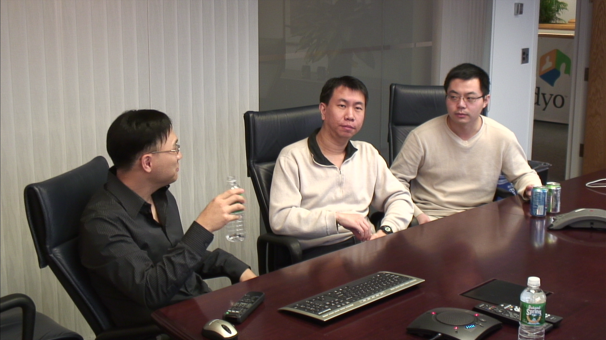
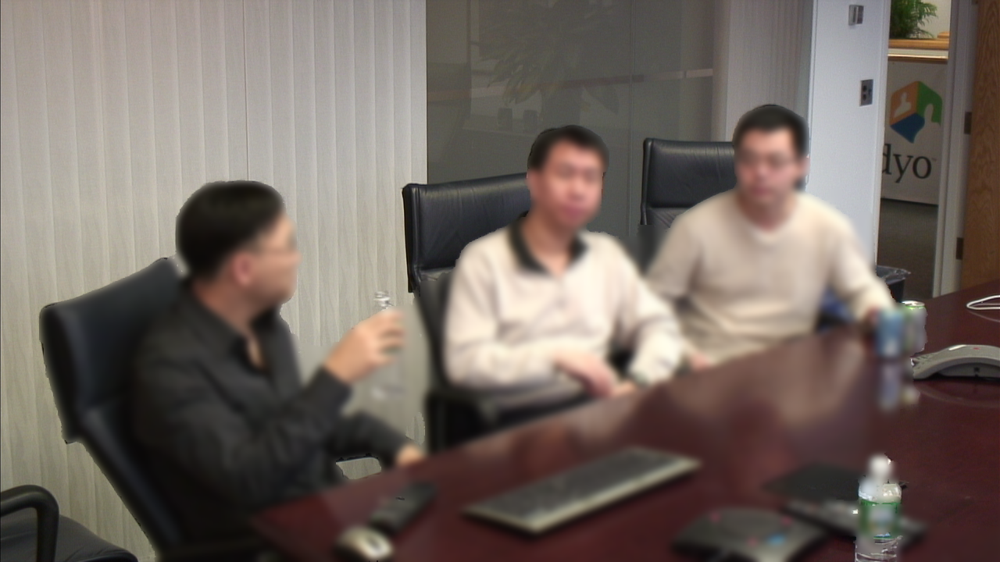
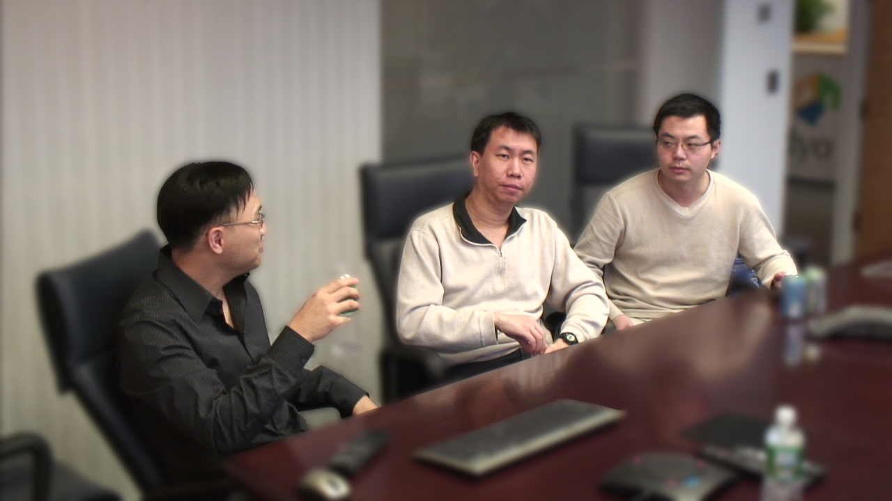
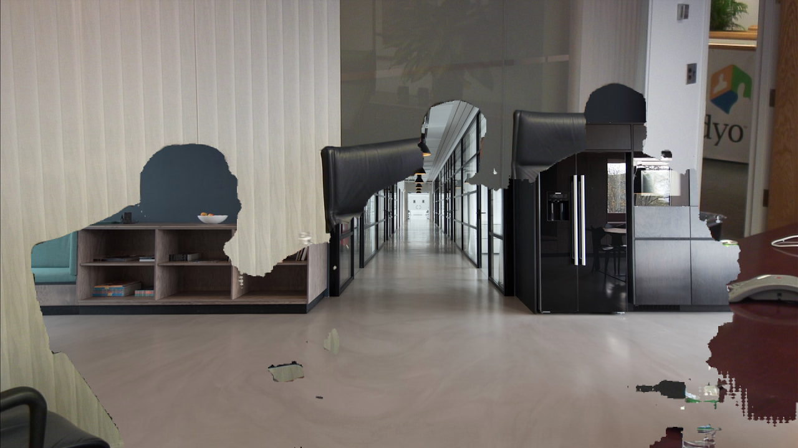
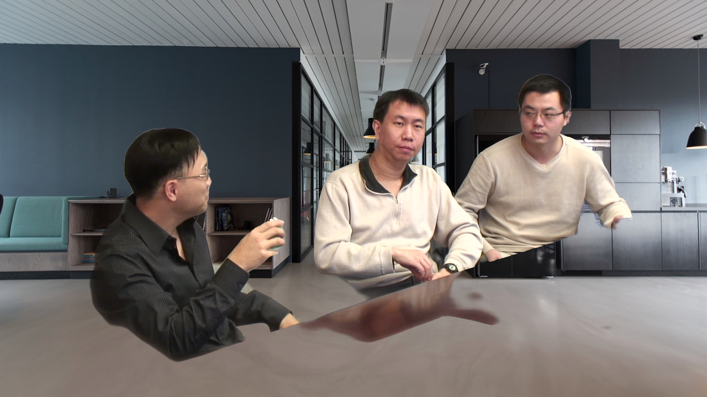

# Meet virtual-background POC — before / after

A/B on a hard 720p multi-person meeting clip (xiph derf vidyo1), identical
frame. Current path = MediaPipe `selfie_segmenter` binary mask + LiveKit
smoothstep composite. New path = `selfie_multiclass` confidence mask + joint
bilateral edge refinement + light-wrap composite. See ../../UPGRADE-MEET.md.

## Original frame

## Background blur

Current (faces blurred away — binary model fails on a multi-person shot):

New (all three sharp, clean edges, room blurred):

## Virtual background (image replacement)

Current (catastrophic — people erased into head-shaped holes, room kept):

New (all three cleanly composited, natural edges, no haze):

